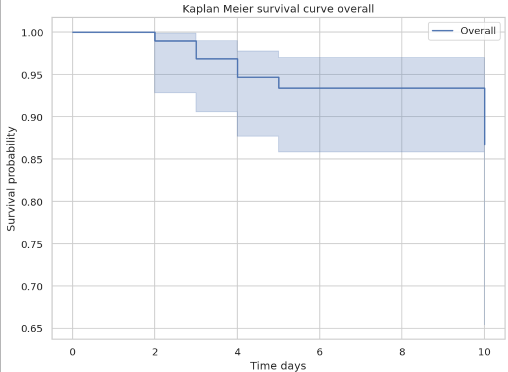
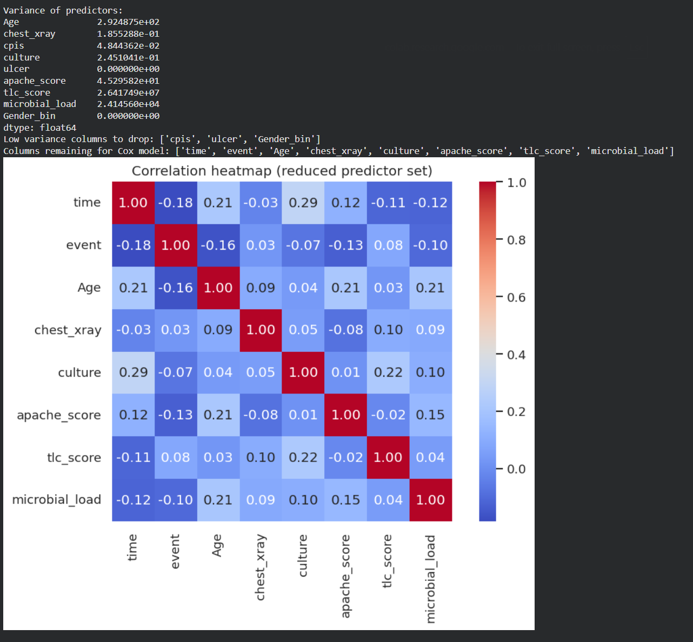
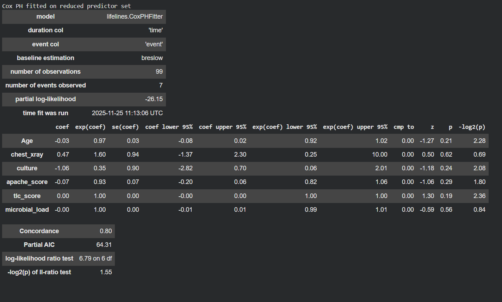
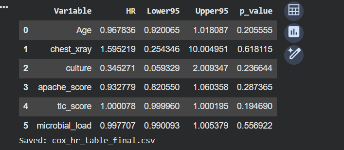
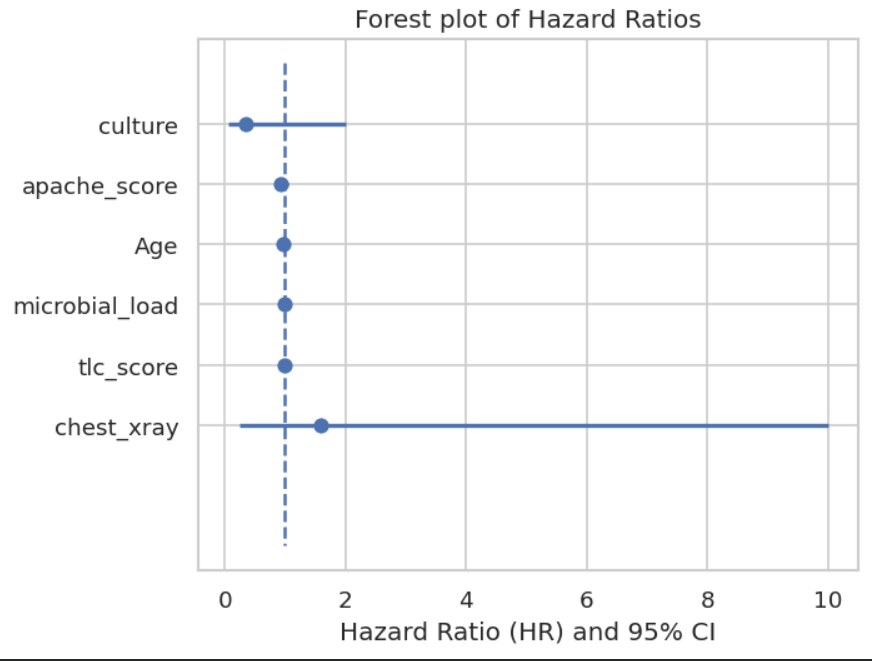
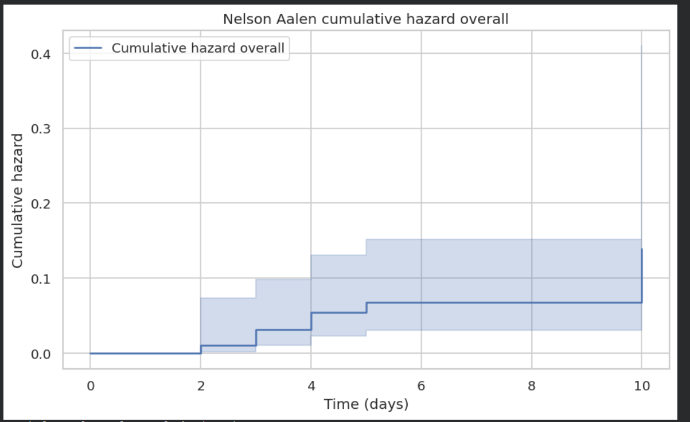

<p align="center">

  <!-- FULL BADGE COLLECTION -->
  
  
  
  
  
  
  
  
  


</p>

<hr>


# **Survival Analysis of Chlorhexidine Trial Outcomes Using Python** 🧪📈

This project is based on a real clinical trial case study titled  
**“Effectiveness of Oral Hygiene with Chlorhexidine Mouthwash with 0.12% and 0.2% Concentration on Incidence of VAP”**  
published in *Annals of International Medical and Dental Research, Vol (7), Issue (3) 2021*.  
The complete article is included in this repository as **Effectiveness of Oral Hygiene with Chlorhexidine Mouthwash.pdf**.  
(If needed locally use: [Effectiveness of Oral Hygiene with Chlorhexidine Mouthwash](./data/Effectiveness%20of%20Oral%20Hygiene%20with%20Chlorhexidine%20Mouthwash.pdf))


This repository reproduces and interprets **time-to-VAP (Ventilator-Associated Pneumonia)** outcomes using classical Survival Analysis methods in Python. All results, tables, and plots are generated via the **Chlorhexidine_Trials.ipynb**.

---

## **1️⃣ Project Title**  
**Survival Analysis of Chlorhexidine Trial Outcomes Using Python**

---

## **2️⃣ Project Summary** ✍️

This project analyses patient-level data from a randomized controlled trial comparing **0.12% vs 0.20% chlorhexidine** mouthwash for preventing Ventilator-Associated Pneumonia (VAP) in mechanically ventilated ICU patients.

- **Outcome:** time (days) until VAP (event = 1) with censoring for discharge, death, or LAMA (event = 0).  
- **Why survival analysis:** follow-up times vary and many patients are censored, so time-to-event methods are required.  
- **Learning outcomes:** Kaplan–Meier estimation, Log-Rank test, Cox Proportional Hazards modelling, Schoenfeld residuals, and clinical interpretation.

---

## **3️⃣ Dataset Description** 📚

- **Source:** Hospital-based randomized controlled trial, 140 patients randomized to two arms (0.12% vs 0.20% chlorhexidine).  
- **Working data:** cleaned dataset derived from [Raw Data from Chlorhexidine Trial](./data/Raw%20Data%20from%20Chlorhexidine%20Trial.xlsx).


### **Variable Dictionary**

| **Variable Name** | **Description** | **Type** | **Values / Units** |
|-------------------|------------------|----------|---------------------|
| trial_arm | Treatment group allocation | Categorical | 1 = 0.12 percent, 2 = 0.20 percent |
| Age | Age of patient | Numerical | Years |
| Gender | Biological sex | Categorical | Male / Female |
| event | VAP occurrence | Binary | 1 = VAP, 0 = No VAP |
| chest_xray | X-ray findings | Binary | 1 = Abnormal, 0 = Normal |
| cpis | Clinical Pulmonary Score | Numerical | 1 = CPIS > 6, 0 = CPIS ≤ 6 |
| time | Follow-up duration | Numerical | Days |
| culture | Culture growth | Binary | 1 = Positive, 0 = Negative |
| ulcer | Aphthous ulcer | Binary | 1 = Present, 0 = Absent |
| apache_score | APACHE II severity score | Numerical | Score |
| tlc_score | Total leukocyte count | Numerical | cells per μL |
| microbial_load | Microbial count | Numerical | CFU |

---

## **4️⃣ Problem Statement** ❓

Key clinical questions this project answers:

1. Does chlorhexidine 0.20% reduce the hazard of developing VAP compared to 0.12%?  
2. Is VAP-free survival different between the two treatment arms?  
3. Do baseline predictors — Age, APACHE II, TLC Day 1, Gender — influence time to VAP?  
4. Do survival curves differ by arm when tested with the Log-Rank test?  
5. What is the clinical interpretation of hazard ratios from a Cox PH model?

---

## **5️⃣ Objectives** 🎯

1. Data cleaning and preprocessing  
2. Exploratory Data Analysis (EDA) and baseline summary statistics  
3. Estimate survival curves (Kaplan–Meier) overall and by arm  
4. Compare groups using the Log-Rank test  
5. Fit a Cox Proportional Hazards model and report hazard ratios  
6. Check proportional hazards assumptions (Schoenfeld residuals)  
7. Produce clear visualizations and clinical interpretation

---

## **6️⃣ Methodology** 🛠️

### **6.1 Data Preparation**

### **Column Standardization**
- “APACHE II Score” → `apache_score`
- “Average of 10 Day TLC Score” → `tlc_score`

### **Binary Conversions**
- **event:** 1 = VAP, 0 = censored  
- **trial_arm:** “Group 1” → 1; “Group 2” → 2  
- **chest_xray:** clear = 0; abnormal = 1  

### **Missing Value Handling**
- Numeric predictors used in KM/Cox models were imputed using **median imputation**.

### **Predictor Selection**
A clean dataset required availability of key predictors:
`age`, `apache_score`, `tlc_score`, `microbial_load`, `culture`, `chest_xray`.

---

## **🔍 Exploratory Data Analysis (EDA)**

A preliminary overview of the dataset was performed to understand patient characteristics and the distribution of key clinical variables relevant to Survival Analysis.

**Summary Statistics (N = 99):**

| **Variable** | **Value** |
|--------------|-----------|
| **Total sample size (N)** | 99 |
| **Events (VAP cases)** | 7 |
| **Time to event, mean (SD)** | 5.9 (2.3) days |
| **Age, mean (SD)** | 47.1 (17.1) years |
| **APACHE II score, mean (SD)** | 17.1 (6.7) |

**Interpretation:**
- The **event rate is low (7.07 percent)**, which explains the flat Kaplan–Meier curves and wide confidence intervals.
- The **average follow-up time** is around 6 days.
- Patients were relatively young to middle-aged, with a **broad age distribution**.
- The **APACHE II scores** indicate moderate illness severity, aligning with typical ventilated ICU populations.

---

## **Criteria used to convert raw data →**

### **1. Standardised and renamed columns**
Raw column names were cleaned to consistent, analysis-friendly names.  
• “APACHE II Score” → `apache_score`  
• “Average of 10 Day TLC Score” → `tlc_score`

### **2. Converted event variable**
Raw event indicator was converted into integer:  
• event = 1 if VAP occurred  
• event = 0 if censored  

### **3. Converted TrialArm to numeric coding**
Raw text values were mapped as:  
• “Group 1” → 1  
• “Group 2” → 2  

### **4. Converted Chest X-ray interpretations into binary coding**
• Lung field clear → 0  
• Any significant findings → 1  

### **5. Ensured essential predictors were present**
After cleaning, the dataset was required to contain all important modelling variables.

### **6. Imputed missing numeric values**
For variables entering Cox or KM analysis, missing values were filled using:  
• median imputation  

---

### **Survival Modelling**
Applied methods:
- Overall Kaplan–Meier survival curve  
- KM curves stratified by treatment arm  
- Log-Rank test (Arm 1 vs Arm 2)  
- Cox Proportional Hazards model (multivariable)  
- Schoenfeld residuals and PH assumption checks
- Nelson–Aalen Cumulative Hazard (Overall)
- Event Distribution Plot
  
---

## **7️⃣ Python Implementation Structure** 💻
📁 Project Structure
```
.
├── data/
│   ├── Chlorhexidine Trials.xlsx
│   ├── Effectiveness of Oral Hygiene with Chlorhexidine Mouthwash.pdf
│   ├── Raw Data from Chlorhexidine Trial.xlsx
│
├── results/
│   ├── correlation.png
│   ├── km_overall.png
│   ├── km_by_arm.png
│   ├── cox_summary.png
│   ├── hazard_ratio.png
│   ├── cox_hazards.png
│   ├── ph_age.png
│   ├── ph_event_distribution.png
│   ├── ph_gender.png
│   ├── ph_tlc.png
│   ├── ph_culture.png
│   ├── ph_microbial.png
│   ├── ph_apache.png
│   ├── ph_xray.png
│   ├── cox_forest.png
│   ├── nelson_overall.png
│   ├── nelson_by_arm.png
│
├── Chlorhexidine_Trials.ipynb
├── LICENSE
└── README.md
```
---

## **9️⃣ Results & Interpretation** 🧾

### **1. Kaplan–Meier Survival (Overall)**  

<div align="center">
  
</div>

This curve shows the probability of remaining VAP free over 10 days.

### **Key numericals:**
• Total patients: 99  
• Total VAP events: 7  
• Overall survival probability remains high: ~0.92 to 1.00  

Patients rarely developed VAP. The curve has only a few drops because very few events happened. The shaded area represents the confidence interval, which is wide due to the small sample size.

### **Interpretation:**  
Most patients remained VAP-free throughout the hospital stay. No sudden fall in survival probability is observed.

---

### **2. Kaplan–Meier by Trial Arm**  
<div align="center">
  
</div>

### **Arm labels:**  
• Arm 1 = 0.12 percent  
• Arm 2 = 0.2 percent  

### **Numerical findings:**  
• Arm 1 survival probability at day 5 ≈ 0.909  
• Arm 2 survival probability at day 5 ≈ 0.974  

By day 10:  
• Arm 2 survival ≈ 97 percent  
• Arm 1 survival ≈ 80 percent  

This shows Arm 2 had fewer VAP cases and maintained a higher VAP-free probability.

### **Interpretation:**  
Arm 2 (0.2 percent) shows slightly better VAP-free survival, but the difference is small due to low event count.

---

### **3. Log-Rank Test**

• Chi-square: 1.938  
• Degrees of freedom: 1  
• p-value: 0.1638  

### **Interpretation:**  
Since p > 0.05, there is **no statistically significant difference** in survival between Arm 1 and Arm 2, even though Arm 2 looks slightly better.  
This is mainly due to the very low number of events (only 7).

---
### **4 - Correlation Heatmap of Predictors**
<div align="center">
  
</div>

This graph checks how strongly variables relate to each other.

### **Observed:**  
• Most values lie between −0.2 and +0.2  
• No strong correlations (strong = >0.7)  
• Age, chest X-ray, microbial load, APACHE, TLC, culture all show independent patterns  

### **Clinical interpretation:**  
Low correlation is good because:  
• Variables do not interfere with each other  
• Cox model becomes more stable  
• Predictors provide unique, non-overlapping information  

Therefore, predictors chosen (age, APACHE, TLC, culture, X-ray) are statistically suitable.

### **Why ULCER was removed:**  
ULCER had **zero variance** (almost all values the same).  
Variables with no variability distort correlation analysis and weaken Cox modelling.

---

### **5. Cox Proportional Hazards (Multivariable)**  

<div align="center">
  
</div>

This table explains how each variable influences hazard of developing VAP.

<div align="center">
  
</div>

### **Hazard Ratios:**  
• Age: 0.96 → slight protective effect  
• Chest X-ray abnormality: 1.59 → higher hazard but very wide CI (0.25–10)  
• Culture positive: 0.34 → appears protective but CI includes 2  
• APACHE score: 0.93 → weak effect  
• TLC Day 1: 1.000 → no effect  
• Microbial load: 0.99 → neutral  

### **Statistical interpretation:**  
• All p-values > 0.2  
• None of the predictors significantly influence VAP hazard  
• CIs are very wide due to low event count (only 7 events)

### **Clinical interpretation:**  
No factor shows meaningful association with VAP.  
Matches published study finding that microbial load does not correlate with VAP.

---

### **6. Forest plot for Cox proportional hazards model**  
<div align="center">
  
</div>

### **Observed:**  
• All predictor CIs cross HR = 1  
• No variable shows a clear significant effect  
• Chest X-ray HR = 1.59 but CI 0.25–10 → unreliable  

### **Interpretation:**  
Because all CIs cross 1, no predictor is significant.  
This is due to the small number of VAP cases.

---

## **7 - Schoenfeld Residual Plots (PH Assumption Test)**

These graphs evaluate whether the Cox model satisfies proportional hazards.

### **Observed:**  
• Residuals fluctuate around zero  
• No upward or downward trend  
• All p-values > 0.05  

### **Interpretation:**  
Cox model assumptions are satisfied.  
Hazard ratios remain stable over time.
---

### **8. Nelson Aalen cumulative hazard plots**  
<div align="center">
  
</div>

• Cumulative hazard remains <0.10  
• Steps in the curve are small and sparse  
• Reflects low VAP incidence  

### **Clinical meaning:**  
VAP was infrequent throughout the observation period.
  
---

### **9 - Event Distribution Plot**

<div align="center">
  
</div>

• Most patients were censored (discharged/LAMA)  
• Only 9 events recorded  
• Explains why KM curves remain nearly flat  
• High censoring reduces statistical power  

### **Clinical meaning:**  
VAP was rare in both arms.

---

### **🔟 Discussion** 💬

The survival analysis shows a consistent pattern:

• VAP incidence was **very low (7 percent)**.  
• Survival curves for both concentrations stayed **above 90 percent**.  
• Arm 2 (0.2 percent) performed slightly better visually, but not statistically significant.  
• Cox regression detected **no significant predictors**, expected due to few events.  
• PH assumptions were satisfied → model is valid.  
• Low cumulative hazard & flat KM curve confirm excellent VAP prevention.

### **Clinical conclusion:**  
Both concentrations (0.12 percent and 0.2 percent) are effective in preventing VAP.

---

### **1️⃣1️⃣ Conclusion** ✅


1. Both groups had high VAP-free survival (>90 percent) by day 10.  
2. Arm 2 (0.2 percent) performed slightly better but not significantly.  
3. Cox regression showed no significant predictors due to low event count.  
4. PH assumptions were satisfied.  
5. Overall VAP incidence was very low, confirming strong effectiveness of oral hygiene protocol.
---

### **1️⃣2️⃣ Future Work** 🔭

To strengthen future analyses:

1. **Expand sample size** → increases events, improves model stability  
2. **Use time-varying covariates** (TLC, microbial load)  
3. **Explore parametric models** (Weibull, Gompertz)  
4. **Add more clinical predictors** (sedation, ventilation duration, antibiotics, comorbidities)  
5. **Apply ML survival models** (Random Survival Forests, DeepSurv)

---

### **Citation**
- Original trial paper: *Nagesh Vyas, Priya Mathur, Shailesh Jhawar, Akash Prabhune, Pradeep Vimal (2021).*  
- Notebook: `Chlorhexidine_Trials.ipynb`  
- Case study PDF path: `/data/Effectiveness of Oral Hygiene with Chlorhexidine Mouthwash.pdf`

---

### **License**
- This project is licensed under the MIT License.
- You are free to use, modify, distribute, and build upon this work, provided that the original license is included with any copies or substantial portions of the software.
- View Full License: [MIT License](LICENSE)
<br>
**End of README**

