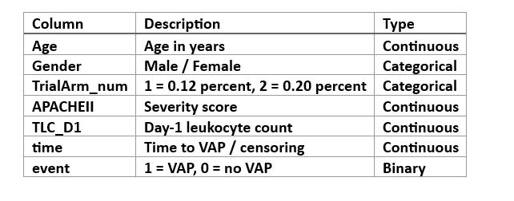

<h1>Survival Analysis of Chlorhexidine Trial Outcomes Using Python</h1>
 
This project is based on a real clinical trial case study titled
“Effectiveness of Oral Hygiene with Chlorhexidine Mouthwash with 0.12 percent and 0.2 percent Concentration on Incidence of VAP”
published in Annals of International Medical and Dental Research (2021).
The complete article is included in this repository as V7N3_e4a9253f-6b0b-4153-a4a4-7ef730d0ac80.pdf .

The analysis performed in this repository reproduces and interprets the time-to-VAP (Ventilator-Associated Pneumonia) outcomes using classical Survival Analysis methods in Python. All results, tables, and plots are generated through the script Chlorhexidine_Trials.ipynb
 
### 1️⃣ Project Title
 
Survival Analysis of Chlorhexidine Trial Outcomes Using Python
 
### 2️⃣ Project Summary
 
This project analyzes patient-level data from a randomized controlled trial comparing 0.12 percent vs 0.20 percent chlorhexidine mouthwash for preventing Ventilator-Associated Pneumonia (VAP) in ICU patients on mechanical ventilation.
The survival outcome is time (days) until development of VAP, with censoring for patients who were discharged, died, or left against medical advice before the event.
Survival analysis is appropriate because not all patients develop VAP, follow-up times vary, and censoring must be accounted for.
This is based on complete survival-analysis workflow: Kaplan–Meier estimation, log-rank test, Cox proportional hazards modelling, and interpretation of hazard ratios in a clinical context.
 
### 3️⃣ Dataset Description
 
The dataset originates from a hospital-based RCT involving 140 ICU patients randomized to two arms (0.12 percent vs 0.20 percent chlorhexidine).
The cleaned dataset used for analysis was derived from the Excel file Raw Data form Chlorhexidine Trial.xlsx

### 📘 Data Dictionary

  

